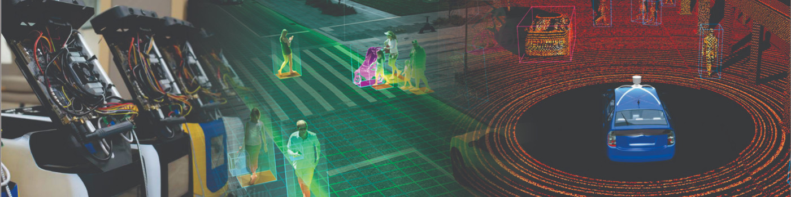

## **Social Distancing Analyzer with Face mask detection **

<p align="center">
  
</p>

Considering the big change that the world is facing, as well as our lives due to the COVID-19, we provide to people and companies a complete open-source tool to analyze the social distancing for streets, parks, offices, and even crowded places like malls, train stations, and others. 

Here you have the code and everything that you'll need to perform your own intrinsic and extrinsic calibration, and run a YOLOv4 based object detection model to track the people in a warped space and analyze how far or close they are to each other (Social Distancing).

The current pipeline only supports videos, but you can use the base classes, and methods to extend the application to video streamings, pictures and adapt it to your own project or application. Here, we will explain the dependencies, the code, and everything that you need to rock and roll!

**Status**: Archive (code is provided as-is, no updates expected)

<p align="center">

</p>

<sub>#computer-vision #Ai #object-detection #yolo #yolo4 #python3 #Docker #covid19 #extrinsic #intrinsic #calibration #social-distancing #OpenCV #OpenSource #image-processing #deep-learning </sub>

---
### **Install Anaconda Environment**

Anaconda is the preferred method of installing SafeDistanceDetector dependencies on Linux Systems (Only for Extrinsic and Intrinsic calibration process). Anaconda is a data science platform for scientific computing and makes managing machine learning libraries significantly easier. Native installation of these libraries is possible, but native un-installation of these libraries can be significantly painful and introduce significantly much more bloat. which is why We DO not will not be supporting that method of installation.

To download the installer, follow this link and download the Anaconda platform for Linux x64. https://www.anaconda.com/distribution/#linux.

After installing the platform, you might need to add conda command into your path for further usage of the platform. You can do this with the following commands.

    export PATH=~/anaconda3/bin:$PATH
    conda init bash
    # Restart your shell
    
---
### **Install SafeDistanceDetector Environment**

You will now need to create the social distancing analyser environment with the required dependencies and libraries (provided in ```requirements.txt```). 

To create and to activate the environment, run:

    conda create -n distancing_analyser -c main python=3.6.8
    conda activate distancing_analyser
    python -m pip install -r ./Safe-Distance-Detector/requirements.txt

After this, fork this repo and make sure that your environment is activated and you are in the root path. Again, this environment is only for Intrinsic (If needed) and Extrinsic calibration scripts, you can not run nothing related to object detection on this environment.

---

## Contents

1. [Short description](#short-description)
1. [Demo video](#demo-video)
1. [The architecture](#the-architecture)
1. [Long description](#long-description)
1. [Project roadmap](#project-roadmap)
1. [Getting started](#getting-started)
1. [Running the tests](#running-the-tests)
1. [Live demo](#live-demo)
1. [Built with](#built-with)
1. [Authors](#authors)
1. [Acknowledgments](#acknowledgments)

## Short description

### What's the problem?

COVID-19 spreads from person to person even before the symptoms start. The best way to prevent the spread is maintaining a social distance of 6 feet among the individuals. But knowingly or unknowingly the people tend to defy the guidelines imposed by our government. Besides Manual supervision of people by authorities in public areas is both difficult and hazardous moreover there isn’t any practical solution in the market for Small and medium-sized enterprises, which leads to poor decision making during the pandemic.


### The idea

In order to solve these critical problems, we present u COVID101, A technological solution to tackle health precautionary measurements. An automated real-time social distancing and Face Mask detection among the people will not only make the job of the authorities more safe and easy but also remind the public to follow the required guidelines. This can enable effortless regulation among the people facilitating the small scale companies to recommence without compromising safety.

With the Real-time graphical analysis of the situation in a given area like the average distance among the people, no of people not following social distancing, Social distancing Index. Will help us to understand the necessary steps that need to be taken in order to flatten the curve.

This software is customizable to hardware components too. Social distancing detection is combined with drones for seamless surveillance in restricted areas.

## The architecture


1. The live footage from CCTV surveillance systems and Drones is used as an input.
2. The footages will be processed in real-time on a cloud server having a GPU.
3. With the real time video processing, the data generated is stored in a separate csv file.

## Long description

[More detail is available here](https://docs.google.com/presentation/d/1LgQmfI-UdoYnCt_wXGfXAWPUgXm8-CXeJIdRPtDQv2Q/edit?usp=sharing)

## Project roadmap


## Getting started

These instructions will get you a copy of the project up and running on your local machine for development and testing purposes. See deployment for notes on how to deploy the project on a live system.

### Prerequisites and Installing

Install `anaconda with python3` from https://www.anaconda.com/products/enterprise/

```bash
# Tensorflow CPU
conda env create -f conda-cpu-env.yml
conda activate cpu-env

# Tensorflow GPU
conda env create -f conda-gpu-env.yml
conda activate gpu-env
```
#### Downloading official pretrained weights of YOLOv3 - Social Distancing Detection
You can download the yolov3 weights by clicking [here](https://td.angerycat.ml/yolov3.weights) then save them to the weights folder.

#### Saving your yolov3 weights as a TensorFlow model.
Load the weights using `load_weights.py` script. This will convert the yolov3 weights into TensorFlow .ckpt model files!
```
# yolov3
python load_weights.py
```
#### Downloading official pretrained weights of YOLOv3 - Face Mask Detection 

You can download the yolov3 - Face Mask Detection weights by clicking [here](https://td.angerycat.ml/yolov3_mask.weights) then save them to the weights_mask folder.

#### Saving your yolov3 weights as a TensorFlow model.
Load the weights using `load_weights_mask.py` script. This will convert the yolov3 weights into TensorFlow .ckpt model files!
```
# yolov3
python load_weights_mask.py
```

## Running the tests

Explain how to run the automated tests for this system


### Test with a video - Social Distancing

Exectute the file `detect_video.py` script. This will execute the same social distancing algorithms and give a live output on the screen . use the flag `--output` for saving the output file with your prefered name.
uncomment line number `277` to view the live graph outputs. 
```bash
python detect_video.py --video test.mp4 --output test_result.mp4 --output_csv test_csv.csv
```
### Test with a video - Face Mask Detection

Identify the presence of Face Mask among the people in a video by executing `detect_video_mask.py` script. This will yield a live output on your screen.
```bash
python detect_video_mask.py --video test_mask.mp4 --output test_mask_output.mp4
```

## Built with

* [Python](https://python.org) - Programming language which has been used
* [Yolo v3](https://pjreddie.com/darknet/yolo/) - To handle object detection

## Authors

* **Vignesh Charan** - [Vignesh](https://github.com/its-charan-here)
* **Poojan Panchal** - [Poojan](https://github.com/PoojanPanchal)
* **Kaushiv Agarwal** - [Kaushiv](https://github.com/kaushiv)


## License

This project is licensed under the Apache 2 License - see the [LICENSE](LICENSE) file for details

## Acknowledgments

* Based on [The AI Guys](https://github.com/theAIGuysCode/Object-Detection-API).
